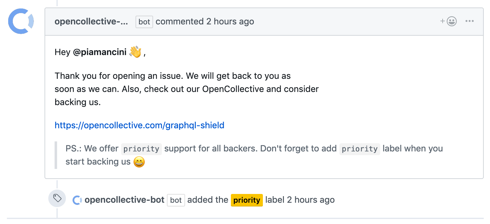
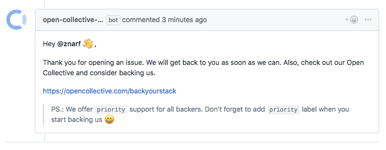

<p align="center"></p>

# Open Collective Bot

[](https://circleci.com/gh/opencollective/opencollective-bot/tree/master)
[](https://codecov.io/gh/opencollective/opencollective-bot)

The Open Collective Bot will comment on issues based on whether the author is already a backer of your [Open Collective](https://opencollective.com/). It can also tag issues based on the same information.

## Overview

- 🐶 **Easy to use:** Simply install [Github App](https://github.com/apps/open-collective-bot) and you are ready to go!
- 🛠 **Customizable:** Change the configuration and our bot will listen!
- ❤ **Covered with tests:** Keeping that 100% bar!

## Configuration

Put your configuration in `.github/opencollective.yml`.

```yaml
collective: graphql-shield
tiers:
  - tiers: '*'
    labels: ['backer']
    message: 'Hey <link>'
  - tiers: ['Sponsor']
    labels: ['sponsor']
    message: 'Hey sponsor <link>'
invitation: |
  Hey <author> :wave:,
  This is an optional message to your audience. Check the
  default message below.

  <link>
```

See some examples:

- [captain-fact](https://github.com/CaptainFact/captain-fact/blob/master/.github/opencollective.yml)
- [more](https://github.com/search?q=%22opencollective.yml%22+in%3Apath&type=Code)

#### Available tags

- **\<author\>:** Author of an issue,
- **\<link\>:** Link to your Open Collective.

#### API

```ts
type Message = string
type GithubLabel = string

type Config = {
  collective: string
  tiers: TierConfig[]
  invitation: Message | false
}

type TierConfig = {
  tiers: Tier[] | '*'
  labels: GithubLabel[]
  message: Message
}
```

Note that the Open Collective Bot won't comment on issues opened by maintainers or other admins of your Collective.

PS: You can test your configuration at https://bot.opencollective.com/validate

##### Default Messages

- `backers`

```
Hey <author> :wave:,

Thanks for backing our project. We will handle your issue with priority support. To make sure we don't forget how special you are, we added a `priority` label to your issue.

Thanks again for backing us :tada:!
```

<p align="center"></p>

- `invitation`

```
Hey <author> :wave:,

Thank you for opening an issue. We will get back to you as soon as we can. Also, check out our Open Collective and consider backing us.

<link>
PS.: We offer `priority` support for all backers. Don't forget to
add `priority` label when you start backing us :smile:
```

<p align="center"></p>

## Development

**Summary**: This project is developed in TypeScript, running with Node and dependencies are managed with Yarn. To configure the project, you will need to create a GitHub App. Because the project relies on Webhooks, you will also need to setup a proxy for that.

See: [docs/development.md](docs/development.md)

## Deployment

**Summary**: This project is currently deployed with [Now](https://zeit.co/now) (v2). To deploy to staging or production, you need to be a core member of the Open Collective team.

See: [docs/deployment.md](docs/deployment.md)

## More documentation:

- [List of supported environment variables](docs/environment-variables.md)

## License

MIT @ Matic Zavadlal
