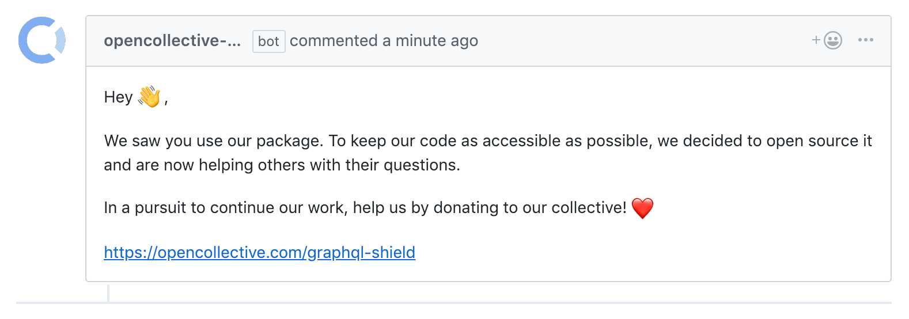

<p align="center"></p>

# OpenCollective Bot

[](https://circleci.com/gh/maticzav/opencollective-bot/tree/master)
[](https://codecov.io/gh/maticzav/opencollective-bot)

> Helps you promote your [Open Collective](https://opencollective.com/) in your Github repository.

## Overview

- 🐶 **Easy to use:** Simply install [Github App](https://github.com/apps/opencollective-bot) and you are ready to go!
- 🛠 **Customizable:** Change the configuration and our bot will listen!
- ❤ **Covered with tests:** Keeping that 100% bar!

## Configuration

Put your configuration in `.github/opencollective.yml`.

```yaml
opencollective: https://opencollective.com/graphql-shield
message: |
  Hey :wave:,
  This is an optional message to your audience. Check the
  default message below.
labels:
  - Question
  - Answer
  - Optional labels, all issues by default.
```

##### Default Message

Hey :wave:,

We saw you use our package. To keep our code as accessible as possible, we decided to open source it and are now helping others with their questions.

In a pursuit to continue our work, help us by donating to our collective! :heart:

---

<p align="center"></p>

## License

> The logo and bot avatar are taken from OpenCollective's marketing website https://opencollective.com/.

MIT @ Matic Zavadlal
